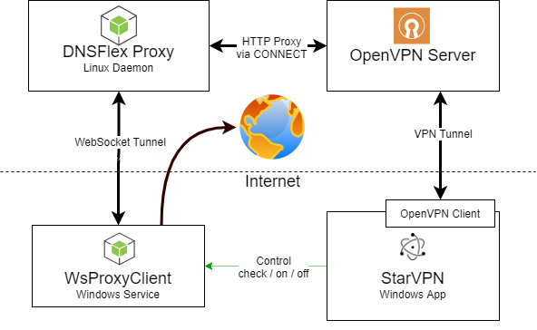

# StarVPN - Residential VPN with peer-to-peer connection sharing

## General architecure

 Solution consist of two repositories

 - DNSFlex_App https://github.com/elifTech/DNSFlex_App
 - DNSFlex_Proxy https://github.com/elifTech/DNSFlex_Proxy

 DNSFlex_App is an Windows desktop application which provide VPN services
 DNSFlex_Proxy is Node.js application for routing internet traffic to peers connected via websocket connection




## DNSFlex_App

  StarVPN is an Electron.js application based on React.js javascript framework.
  Main components of and StarVPN application are
  - GUI application itself
  - tap-windows driver required to establish OpenVPN tunnels
  - OpenVPN binaries to make connections to OpenVPN server using .ovpn config files
  - Websocket proxy client to share users internet connection in case of Free plan usage

### Build & Publish
Before publishing latest version, `GH_TOKEN` environment variable should be set
`$env:GH_TOKEN="token"`

`npm run publish` - will build and publish x64 version to github releases, where auto-updater will pick latest version

After building and uploading build to GitHub you need to go there, find new release and press 'Publish Release'

### StarVPN GUI Application
  Electron apps consist of two main parts (processes):
  - Renderer process, which loads html+js+css of application UI into browser window, and communicate back with main process
  via API calls
  - Main process, exposes internal APIs for renderer process, controls openvpn by preparing .ovpn files based on templates,
  executing openvpn.exe binary for current windows version and parsing its stdout and stderr.
  If main process need to terminate VPN connection, it send KILL signal to openvpn child process.
  Also main process responsible for controlling of the websocket service. It will start and stop it when necessary (described
   in Websocket connection section) and also disable/enable service auto-start (Automatic vs Manual service start policy).

  We use redux library for state management, so every change in the UI state is redux action.
  The benefits on redux library is predictable state, without conflict states.
  We have 2 types of state - persistent state and transient (not persistent).
  Current application screen, error messages, vpn connection status - are parts of transient state. All other state is persisted
  in localStorage of Chrome, which is persisted to AppData\Roaming\starvpn directory by Electron.

### OpenVPN binaries
  As Windows 10 have different driver model, we use 4 different versions of OpenVPN
  - Windows 10 32-bit
  - Windows 10 64-bit
  - Windows 7/8 32-bit
  - Windows 7/8 64-bit
  During installation only two versions installed (both 32-bit versions or both 64-bit versions). Exact binary selected
  during run-time based on os.release() call.

### Websocket proxy
 WebSocket proxy - is a Windows service created by node-windows library, which wraps javascript file into windows .exe file.
 Node.js v12 32-bit (also compatible with 64-bit Windows) is bundled with application to run javascript websocket proxy.
 This service uses socket.io (which uses websocket under the hood). Service connects to proxy server using websocket protocol
 and waits for incoming connections. After receiving incoming connection it will forward it to the internet, optionally
 bypassing VPN-tunnel by specifying network interface to use.
 To detect network interface directly connected to internet, service periodically polls system network settings (in case
 external IP is changed).

### Installer

We use electron-builder to pack application into NSIS installer.
Currently electron-builder builds for 2 target platforms: ia32 and x64, it also bundles additional resources like:
tap-windows driver, openvpn binaries, it creates application auto-start entry (via .vbs wrapper) and creates uninstaller.
Uninstaller removes all the application data (persisted state and logs) as well as Application itself, deregister websocket
proxy service and calls API to terminate user (Last logged in user).

### Building application

Prerequisites:
 Node, Npm, Python, Visual Studio build tools

 First download and install node.js from https://nodejs.org/en/download/

 To install python & visual studio build tools:
 `npm install --global --production windows-build-tools`

 To build an application, please follow next steps:
 Clone repository https://github.com/elifTech/DNSFlex_App by
 `git clone https://github.com/elifTech/DNSFlex_App`

 Enter application directory
 `cd DNSFlex_App`

 Install dependencies
 `npm install`

 Run build process (should be run in cmd/Powershell with Admin permissions)
 `npm run pack:win`

 Then you'll find install file in `dist/` subdirectory, together with application binary.

### Main Flows

#### WebSocket connection
 Websocket service is installed during application install in the state: Stopped, Manual start.
 If user logs-in with free account, we'll start service and mark it as Automatic - to start service with Windows.
 This will be persisted even after user logs out.
 If premium user logs in - we'll stop service (if it is running) and set it to Manual.

 Here is full table of WebSocket connection service states

 | Application | User / Logged out User | Service Status / Auto-start
 |:---:|:---:|:---:|
 |not running / just installed|- / -|stopped / manual|
 |running|- / - |stopped / manual|
 |running|- / PREMIUM |stopped / manual|
 |running|- / FREE |running / auto|
 |running|- / PREMIUM Trial |running / auto|
 |running|FREE|running / auto|
 |not running|FREE|running / auto|
 |running|PREMIUM Trial|running / auto|
 |not running|PREMIUM Trial|running / auto|
 |running|PREMIUM|stopped / manual|
 |not running|PREMIUM|stopped / manual|

 In other words websocket connection should be active if current logged in user is FREE, PREMIUM Trial or
 last seen user (logged out) was FREE or PREMIUM Trial. So if PREMIUM user logs out - we do not activate websocket
 service.


 If for some reason service will be unavailable (either not present or not possible to start) - we'll block free user
 from using VPN.

 Service is being controlled by various Windows command line tools, like `net` or `sc`.
 You can see the usage of these tools in `app/main/serviceControl.js`, which is responsible for starting / stopping and
 detecting current state of the service.

 Websocket proxy is implemented in `service/src/wsProxyClient.js`.

 As websocket connection is used to share user's IP address with other peers, while VPN connection is active, it needs to
 bypass OpenVPN tunnel. When OpenVPN tunnel established, system route table updated. You can check state of route table
 via `route print`. There is default gateway specified there, like

```
Network Destination        Netmask          Gateway       Interface  Metric
            0.0.0.0          0.0.0.0      192.168.0.1     192.168.0.86     35
```
This means all outgoing packets should go to Gateway IP using specified interface if no other more specific routes exists.
After OpenVPN updates route table it adds 2 new routes to emulate default gateway without overriding original routes.
As more specific routes have higher priority, all outgoing packets now routed to VPN tunnel

```
Network Destination        Netmask          Gateway       Interface  Metric
          0.0.0.0          0.0.0.0      192.168.0.1     192.168.0.86     35
          0.0.0.0        128.0.0.0      10.66.77.93      10.66.77.94      3
        128.0.0.0        128.0.0.0      10.66.77.93      10.66.77.94      3
```

Websocket proxy script performs periodical (every 10 seconds, specified in `IP_REFRESH_INTERVAL`) checks to find previous
 (before vpn connection established) default gateway. Then using that gateway we find which network interface has that
 IP gateway and use interface IP address for outgoing connection when proxying incoming requests from websocket connection.

 Windows management instrumentation command line `wmic` is used to find previous default gateway.
 Exact command is

 ```path Win32_NetworkAdapterConfiguration where IPEnabled=true get DefaultIPGateway,GatewayCostMetric,IPConnectionMetric,Index /format:table```

#### Auto start vpn connection on boot
During installation shortcut to wrapper .vbs script is added to Windows auto-start.
If checkbox `Connect VPN on start up` is selected, VPN connection will be established right after application start.

#### Smart vpn
Smart VPN is the ability to select closest DNS servers, which will be overridden in .ovpn config before establishing
connection. We use native sockets to ping these server. This is the reason why we need python and Visual studio - to build
native modules related to raw socket and ping features.

Request to fetch dns servers is being made in `app/renderer/helpers/app.js`
Line `dnsServers = await getDnsServers();`;
Then these IP addresses are passed to `vpn/connect` route of the internal apis, which will find closest dns servers.
This logic can be found in `app/main/server.js` Route `/vpn/connect`.

#### TCP / UDP Switch
By pressing TCP or UDP, application just changes state. But if OpenVPN connection is already established, this will trigger
disconnect / connect events. So new vpn connection to another server will be established.

This logic can be found in `app/renderer/components/Home.js` `handleProtocol` method.

#### Connecting to closest server
Every time application tries to connect to VPN server, it fetches list of vpn servers then filters out vpn servers not
related to currently selected protocol, and then ping all of the servers, and selects server with minimal round-trip-time.

This logic can be found in `app/main/server.js` Route `/vpn/connect`.


## DNSFlex_Proxy
 This proxy listens for incoming websocket connections (actually socket.io), which will be used to route traffic to.
 Also proxy listens for http requests with specially crafted username and password.
 On the port :8080 there is simple html statistics about connected websocket clients.

See documentation in https://github.com/elifTech/DNSFlex_Proxy repository

#### Proxy Server Authentication
Proxy server accepts incoming connections with basic authentication, where username is sessionid and password is
dash-separated string with options to control (route/limit) this request.

